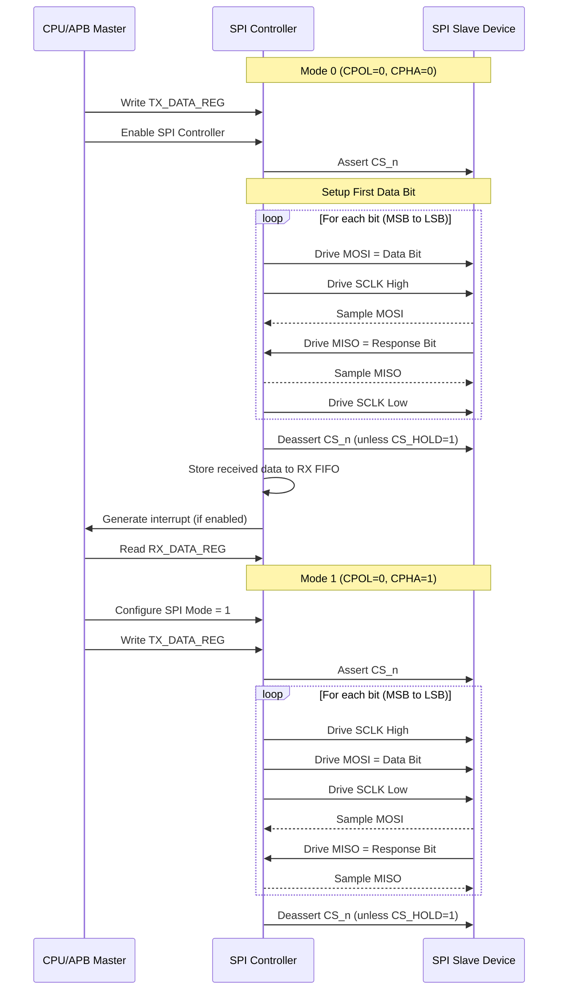
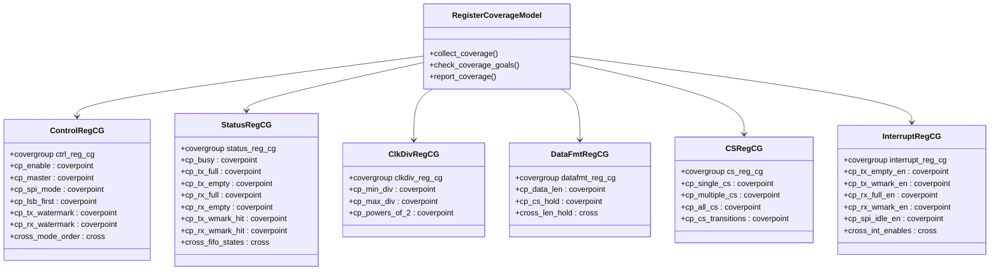
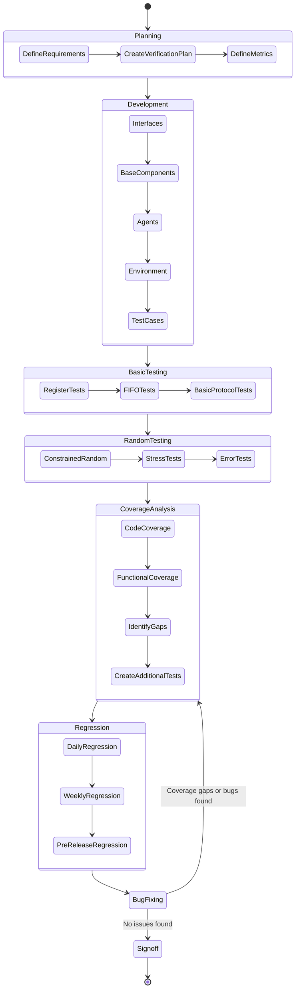

# Advanced SPI Controller - UVM Verification Plan

## 1. Introduction

### 1.1 Purpose
This document outlines the verification plan for the Advanced SPI Controller, a configurable SPI master module with APB3 slave interface. The plan details the verification strategy, methodology, testbench architecture, and specific test scenarios required to verify the functionality of the design as specified in the specification document.

### 1.2 Scope
The verification plan covers:
- Functional verification of all features of the SPI Controller
- Register access verification via the APB3 interface
- Protocol compliance for all SPI modes
- Error condition handling
- Performance verification under various configurations
- Coverage-driven verification approach using UVM methodology

### 1.3 References
- Advanced SPI Controller Specification (Example/Advanced_SPI_Controller/docs/specsheet.md)
- UVM Reference Manual
- APB3 Protocol Specification
- SPI Protocol Specification

## 2. Design Overview

### 2.1 Key Features to Verify
- APB3 slave interface functionality
- SPI master operation in all four modes (0-3)
- Configurable clock divider functionality
- Multiple chip select operation
- TX and RX FIFO functionality
- Interrupt generation for various events
- DMA support for high-speed data transfer
- Configurable data width (4-32 bits)
- LSB/MSB first data transfer
- Chip select hold functionality

### 2.2 Block Diagram

```
                    ┌─────────────────────────────────────────────┐
                    │           Advanced SPI Controller           │
                    │                                             │
┌───────────────┐   │    ┌─────────┐        ┌────────────────┐    │    ┌───────────────┐
│               │   │    │         │        │                │    │    │               │
│  APB Master   ├───┼────► APB     │        │   SPI Master   ├────┼────► SPI Slave     │
│  (CPU/DMA)    │   │    │ Slave   │        │   Interface    │    │    │  Devices      │
│               │   │    │Interface│        │                │    │    │               │
└───────────────┘   │    └────┬────┘        └────────┬───────┘    │    └───────────────┘
                    │         │                      │            │
                    │    ┌────▼────────────────────┐ │            │
                    │    │                         │ │            │
                    │    │  Control Logic & Registers│            │
                    │    │                         │ │            │
                    │    └────┬───────────────────┬┘ │            │
                    │         │                   │  │            │
                    │    ┌────▼────┐         ┌────▼──┘            │
                    │    │         │         │                    │
                    │    │ TX FIFO │         │ RX FIFO            │
                    │    │         │         │                    │
                    │    └─────────┘         └────────────────────┘
                    │                                             │
                    └─────────────────────────────────────────────┘
```

## 3. Verification Strategy

### 3.1 Methodology
- Universal Verification Methodology (UVM) based testbench
- Layered, reusable verification components
- Coverage-driven verification approach
- Constrained-random stimulus generation
- Self-checking mechanisms using scoreboard and reference model
- Assertions for real-time protocol checking

### 3.2 Verification Environment Components
- Test library with various test scenarios
- Environment containing agents, scoreboard, and coverage collectors
- APB master agent for register access
- SPI slave agent for protocol verification
- Reference model for predicting expected behavior
- Scoreboard for comparing actual vs. expected behavior
- Coverage collectors for functional coverage tracking
- Virtual sequences for coordinating complex test scenarios

### 3.3 Verification Phases
1. **Planning**: Define verification goals, strategies, and coverage metrics
2. **Development**: Implement the UVM testbench components
3. **Basic Testing**: Verify fundamental functionality with directed tests
4. **Random Testing**: Apply constrained-random stimulus to explore the design space
5. **Coverage Analysis**: Review coverage metrics and identify gaps
6. **Regression**: Run comprehensive test suites to ensure quality
7. **Signoff**: Achieve verification closure based on coverage goals

## 4. Testbench Architecture

### 4.1 Block Diagram

```
┌───────────────────────────────────────────────────────────────────────────────┐
│                                UVM Tests                                      │
└─────────────────────────────────────┬─────────────────────────────────────────┘
                                      │
                                      ▼
┌───────────────────────────────────────────────────────────────────────────────┐
│                             Virtual Sequences                                 │
└─────────────────────────────────────┬─────────────────────────────────────────┘
                                      │
                                      ▼
┌───────────────────────────────────────────────────────────────────────────────┐
│                          SPI Controller Environment                           │
│                                                                               │
│  ┌───────────────────┐  ┌────────────────┐  ┌───────────────┐ ┌────────────┐  │
│  │                   │  │                │  │  Scoreboard   │ │  Coverage  │  │
│  │   APB Agent       │  │  SPI Agent     │  │               │ │  Collectors│  │
│  │  ┌────────────┐   │  │ ┌────────────┐ │  │               │ │            │  │
│  │  │ Sequencer  │   │  │ │ Monitor    │ │  │               │ │            │  │
│  │  └────┬───────┘   │  │ └────┬───────┘ │  │               │ │            │  │
│  │       │           │  │      │         │  │               │ │            │  │
│  │  ┌────▼───────┐   │  │      │         │  │               │ │            │  │
│  │  │  Driver    │   │  │      │         │  │               │ │            │  │
│  │  └────┬───────┘   │  │      │         │  │               │ │            │  │
│  │       │           │  │      │         │  │               │ │            │  │
│  │  ┌────▼───────┐   │  │      │         │  │               │ │            │  │
│  │  │  Monitor   │───┼──┼──────┼─────────┼──►               │ │            │  │
│  │  └────────────┘   │  │      │         │  │               │ │            │  │
│  │                   │  │      │         │  │               │ │            │  │
│  └─────────┬─────────┘  └──────┼─────────┘  └───────┬───────┘ └────────────┘  │
│            │                   │                    │                         │
│            │             ┌─────▼────────────┐       │                         │
│            └─────────────► Reference Model  ├───────┘                         │
│                          └──────────────────┘                                 │
│                                                                               │
└───────────────────────────────────────────────────────────────────────────────┘
                                      │
                                      ▼
┌───────────────────────────────────────────────────────────────────────────────┐
│                                 Interfaces                                    │
│         ┌────────────────┐                     ┌────────────────┐             │
│         │   APB IF       │                     │   SPI IF       │             │
│         └────────────────┘                     └────────────────┘             │
└───────────────────────────────────────────────────────────────────────────────┘
                                      │
                                      ▼
┌───────────────────────────────────────────────────────────────────────────────┐
│                                                                               │
│                           SPI Controller DUT                                  │
│                                                                               │
└───────────────────────────────────────────────────────────────────────────────┘
```

### 4.2 Component Descriptions

#### 4.2.1 DUT Interfaces
- **APB Interface**: Connects the APB master agent to the DUT's APB slave interface
- **SPI Interface**: Connects the SPI slave agent to the DUT's SPI master interface

#### 4.2.2 UVM Components
- **SPI Controller Base Test**: Foundation for all test scenarios
- **Extended Tests**: Specific test scenarios focusing on different aspects of functionality
- **SPI Controller Environment**: Container for all verification components
- **APB Agent**: Active agent for driving the APB bus
  - Sequencer: Generates APB transactions
  - Driver: Drives APB signals
  - Monitor: Observes and collects APB transactions
- **SPI Agent**: Passive agent for monitoring and checking SPI transactions
  - Monitor: Observes and collects SPI transactions
- **Reference Model**: Predicts expected SPI behavior based on APB transactions
- **Scoreboard**: Compares actual vs. expected behavior
- **Coverage Collectors**: Track functional coverage metrics

## 5. Test Plan

### 5.1 Register Access Tests

#### 5.1.1 Basic Register Access
- **Objective**: Verify correct read/write access to all registers
- **Procedure**:
  - Write and read back all registers
  - Verify read-only bits maintain their values
  - Verify write-only bits function correctly
  - Verify reserved bits read as zero
- **Pass Criteria**:
  - All registers accessible
  - Correct behavior for different access types (R/W, RO, WO)

#### 5.1.2 Register Reset Values
- **Objective**: Verify all registers reset to their specified default values
- **Procedure**:
  - Assert reset
  - Read all registers and verify default values
- **Pass Criteria**: All registers have correct reset values as per specification

#### 5.1.3 Invalid Register Access
- **Objective**: Verify error handling for invalid register accesses
- **Procedure**:
  - Access invalid register addresses
  - Perform write to read-only registers
  - Perform read from write-only registers
- **Pass Criteria**: APB slave error (apb_pslverr) generated for invalid accesses

### 5.2 FIFO Tests

#### 5.2.1 TX FIFO Basic Operation
- **Objective**: Verify TX FIFO basic functionality
- **Procedure**:
  - Write data to TX FIFO
  - Verify status flags (empty, full, level)
  - Verify data is transmitted correctly
- **Pass Criteria**: Data transmitted in correct order, status flags accurate

#### 5.2.2 RX FIFO Basic Operation
- **Objective**: Verify RX FIFO basic functionality
- **Procedure**:
  - Generate SPI transactions to fill RX FIFO
  - Read data from RX FIFO
  - Verify status flags (empty, full, level)
- **Pass Criteria**: Data received in correct order, status flags accurate

#### 5.2.3 FIFO Overflow/Underflow Handling
- **Objective**: Verify proper handling of FIFO overflow and underflow conditions
- **Procedure**:
  - Try to write to TX FIFO when full
  - Try to read from RX FIFO when empty
- **Pass Criteria**:
  - Writes to full TX FIFO are ignored
  - Reads from empty RX FIFO return zero
  - No data corruption occurs

#### 5.2.4 FIFO Watermark Tests
- **Objective**: Verify watermark functionality for both FIFOs
- **Procedure**:
  - Set different watermark levels
  - Generate transactions to cross watermark thresholds
  - Verify watermark status flags
- **Pass Criteria**: Watermark flags assert correctly based on FIFO levels

### 5.3 SPI Protocol Tests

#### 5.3.0 SPI Protocol Diagram



#### 5.3.1 SPI Mode Tests
- **Objective**: Verify all four SPI modes (0-3)
- **Procedure**:
  - Configure controller for each mode
  - Perform data transfers in each mode
  - Verify clock polarity (CPOL) and phase (CPHA)
  - Verify data sampling edges
- **Pass Criteria**: Correct timing for each mode, successful data transfers

#### 5.3.2 Clock Divider Tests
- **Objective**: Verify programmable clock divider functionality
- **Procedure**:
  - Configure various clock divider values
  - Measure resulting SPI clock frequency
  - Verify calculations match the formula: spi_clk_freq = system_clk_freq / (2 * clk_div_reg)
- **Pass Criteria**: SPI clock frequency matches expected values

#### 5.3.3 Data Width Tests
- **Objective**: Verify transfers with different data widths
- **Procedure**:
  - Configure for different data widths (4-32 bits)
  - Perform transfers with each width
  - Verify correct number of bits transferred
- **Pass Criteria**: All data widths transfer correctly with proper alignment

#### 5.3.4 Bit Order Tests
- **Objective**: Verify MSB-first and LSB-first transfers
- **Procedure**:
  - Configure for MSB-first and LSB-first transfers
  - Perform transfers in both configurations
  - Verify bit order on SPI bus
- **Pass Criteria**: Bits transmitted in correct order for both configurations

#### 5.3.5 Chip Select Tests
- **Objective**: Verify chip select functionality
- **Procedure**:
  - Configure different chip select lines
  - Verify proper CS assertion/deassertion timing
  - Test multiple CS lines simultaneously
  - Test CS hold between transfers
- **Pass Criteria**: CS signals activate correctly according to configuration

### 5.4 Interrupt Tests

#### 5.4.1 Interrupt Generation
- **Objective**: Verify all interrupt sources
- **Procedure**:
  - Enable each interrupt source individually
  - Create conditions to trigger each interrupt
  - Verify interrupt signal assertion
- **Pass Criteria**: Interrupts generated for all enabled conditions

#### 5.4.2 Interrupt Status and Clearing
- **Objective**: Verify interrupt status bits and clearing mechanism
- **Procedure**:
  - Trigger interrupts
  - Read status register
  - Clear interrupts by writing to status register
  - Verify W1C (write-one-to-clear) behavior
- **Pass Criteria**: Status bits set when conditions occur, cleared when written with 1

### 5.5 DMA Interface Tests

#### 5.5.1 TX DMA Request
- **Objective**: Verify TX DMA request generation
- **Procedure**:
  - Enable TX DMA
  - Create conditions where TX FIFO has space
  - Verify dma_tx_req signal assertion
  - Acknowledge with dma_tx_ack
  - Verify request deassertion
- **Pass Criteria**: DMA request/acknowledge handshaking works correctly

#### 5.5.2 RX DMA Request
- **Objective**: Verify RX DMA request generation
- **Procedure**:
  - Enable RX DMA
  - Create conditions where RX FIFO has data
  - Verify dma_rx_req signal assertion
  - Acknowledge with dma_rx_ack
  - Verify request deassertion
- **Pass Criteria**: DMA request/acknowledge handshaking works correctly

### 5.6 Performance and Stress Tests

#### 5.6.1 Back-to-Back Transfers
- **Objective**: Verify continuous operation with back-to-back transfers
- **Procedure**:
  - Fill TX FIFO
  - Configure for continuous operation
  - Monitor for data integrity during extended transfers
- **Pass Criteria**: All data transferred correctly without gaps

#### 5.6.2 Maximum Speed Test
- **Objective**: Verify operation at maximum SPI clock frequency
- **Procedure**:
  - Configure minimum clock divider
  - Perform data transfers
  - Verify timing and data integrity
- **Pass Criteria**: Correct operation at maximum speed

#### 5.6.3 Load Testing
- **Objective**: Verify behavior under heavy load conditions
- **Procedure**:
  - Generate rapid APB transactions
  - Perform simultaneous operations (register access during transfers)
  - Verify correct prioritization and handling
- **Pass Criteria**: Stable operation under load, no data corruption

### 5.7 Error Handling Tests

#### 5.7.1 Reset During Transfer
- **Objective**: Verify proper recovery from reset during active transfer
- **Procedure**:
  - Start SPI transfer
  - Assert reset during transfer
  - Verify proper reset behavior
  - Verify controller returns to idle state
- **Pass Criteria**: Graceful recovery from reset, no hanging states

#### 5.7.2 Disable During Transfer
- **Objective**: Verify behavior when disabled during active transfer
- **Procedure**:
  - Start SPI transfer
  - Disable controller during transfer
  - Verify transfer completes or aborts cleanly
- **Pass Criteria**: No protocol violations, clean transition to disabled state

## 6. Functional Coverage Plan

### 6.1 Configuration Coverage

#### 6.1.0 Register Coverage Model Diagram



#### 6.1.1 SPI Mode Coverage
- All four SPI modes (0-3) tested
- Transitions between different modes
- Cross with data widths and bit ordering

#### 6.1.2 Clock Divider Coverage
- Range of clock divider values: minimum, typical, maximum
- Boundary values (1, 2, max-1, max)
- Power-of-2 values (2, 4, 8, 16, etc.)

#### 6.1.3 Data Width Coverage
- All supported data widths (4-32 bits)
- Boundary values (4, 5, 31, 32)
- Common values (8, 16, 24, 32)

#### 6.1.4 Bit Order Coverage
- Both MSB-first and LSB-first transfers
- Transitions between bit order settings

#### 6.1.5 Chip Select Coverage
- All chip select lines used
- Multiple combinations of chip select lines
- CS hold enabled and disabled
- CS transitions (asserted to deasserted and vice versa)

### 6.2 Operational Coverage

#### 6.2.1 FIFO State Coverage
- TX FIFO: empty, partially filled, full states
- RX FIFO: empty, partially filled, full states
- Transitions between states
- Various fill levels

#### 6.2.2 Watermark Coverage
- Range of watermark values
- Watermark threshold crossings (below→above, above→below)
- Cross with interrupt generation

#### 6.2.3 Transfer Coverage
- Single transfers
- Burst transfers with CS hold
- Various data patterns (all 0s, all 1s, alternating, random)
- Data transition patterns (0→1, 1→0)

#### 6.2.4 Interrupt Coverage
- All interrupt sources triggered
- Multiple simultaneous interrupts
- Interrupt clearing sequences
- Cross with operational states

#### 6.2.5 DMA Coverage
- TX DMA request/acknowledge handshaking
- RX DMA request/acknowledge handshaking
- DMA enable/disable transitions
- Cross with FIFO states

### 6.3 Protocol Coverage

#### 6.3.1 APB Protocol Coverage
- All APB phases (setup, access)
- Read and write transfers
- Error conditions
- Back-to-back transfers

#### 6.3.2 SPI Protocol Coverage
- Clock polarity and phase for all modes
- Data setup and hold times
- CS assertion/deassertion timing
- Multi-byte transfers

## 7. Assertions

### 7.1 Protocol Assertions

#### 7.1.1 APB Protocol Assertions
- Valid APB address phase before enable phase
- No change in control signals during enable phase
- Valid slave response timing

#### 7.1.2 SPI Protocol Assertions
- Clock polarity matches mode setting
- Data changes on correct clock edges based on mode
- CS assertion before first clock edge
- CS deassertion after last clock edge (unless CS hold enabled)
- Minimum CS deassertion time between transfers

### 7.2 Functional Assertions

#### 7.2.1 FIFO Assertions
- TX FIFO empty after reset
- RX FIFO empty after reset
- No writes accepted when TX FIFO full
- No valid data when RX FIFO empty
- FIFO pointers increment/decrement correctly

#### 7.2.2 Control Assertions
- No SPI transfers when controller disabled
- Correct SPI clock frequency based on divider
- Interrupt signal assertion when enabled interrupt conditions occur
- DMA request signal assertions based on FIFO state and DMA enable

## 8. Implementation Plan

### 8.0 Verification Workflow Diagram



### 8.1 Development Phases

#### 8.1.1 Phase 1: Basic Infrastructure
- Create UVM component skeleton
- Implement APB and SPI interfaces
- Develop base test framework
- Implement basic register access test

#### 8.1.2 Phase 2: Core Functionality
- Implement APB agent components
- Implement SPI agent components
- Develop reference model
- Implement basic scoreboard
- Create simple directed tests

#### 8.1.3 Phase 3: Advanced Features
- Enhance reference model with all features
- Implement coverage collectors
- Develop randomized tests
- Create complex test sequences

#### 8.1.4 Phase 4: Verification Closure
- Address coverage holes
- Implement corner case tests
- Run full regression
- Generate verification reports

### 8.2 Schedule
| Phase | Task | Timeline |
|-------|------|----------|
| Planning | Verification plan | Week 1 |
| Phase 1 | Basic infrastructure | Weeks 1-2 |
| Phase 2 | Core functionality | Weeks 2-3 |
| Phase 3 | Advanced features | Weeks 3-4 |
| Phase 4 | Verification closure | Weeks 4-5 |
| Signoff | Final report | Week 5 |

### 8.3 Verification Milestones
1. **Testbench Architecture Complete**: All components implemented
2. **Basic Functionality Verified**: Register access, simple transfers
3. **Feature Verification Complete**: All features tested with directed tests
4. **Random Verification Complete**: All features tested with random tests
5. **Code Coverage Goal Met**: 95% line and toggle coverage
6. **Functional Coverage Goal Met**: 100% of defined coverage points
7. **Verification Signoff**: All tests pass, coverage goals met

## 9. Regression Strategy

### 9.1 Test Groups

#### 9.1.1 Smoke Tests
- Basic register access
- Simple SPI transfers
- Reset functionality
- Quick verification of core functionality

#### 9.1.2 Feature Tests
- Comprehensive tests for each feature
- Protocol compliance tests
- Error handling tests
- Configuration tests

#### 9.1.3 Random Tests
- Constrained random tests
- Long-running stress tests
- Performance tests

### 9.2 Regression Execution
- Daily regression: Smoke tests + rotating feature tests
- Weekly regression: Full test suite
- Pre-release regression: Extended random tests + full test suite

### 9.3 Pass Criteria
- 100% of tests pass
- 95% code coverage (line, toggle, branch)
- 100% functional coverage
- 0 open bugs
- All assertions pass

## 10. Verification Metrics and Reporting

### 10.1 Coverage Metrics
- Line coverage: 95% target
- Toggle coverage: 95% target
- Functional coverage: 100% target
- Assertion coverage: 100% target

### 10.2 Quality Metrics
- Bug find rate and trend
- Bug closure rate
- Coverage convergence
- Test pass rate

### 10.3 Reports
- Daily status report
- Weekly coverage report
- Bug report
- Final verification report

## 11. Verification Risks and Mitigations

### 11.1 Risk Assessment Matrix

```mermaid
quadrantChart
    title Risk Assessment Matrix
    x-axis Low --> High (Likelihood)
    y-axis Low --> High (Impact)
    quadrant-1 High Impact, Low Likelihood
    quadrant-2 High Impact, High Likelihood
    quadrant-3 Low Impact, Low Likelihood
    quadrant-4 Low Impact, High Likelihood
    "Performance issues under load": [0.3, 0.6]
    "Simulation performance bottlenecks": [0.5, 0.5]
    "Incomplete feature coverage": [0.5, 0.9]
    "Complex corner cases missed": [0.5, 0.8]
    "Schedule delays": [0.6, 0.7]
```

| Risk | Impact | Likelihood | Mitigation |
|------|--------|------------|------------|
| Incomplete feature coverage | High | Medium | Detailed coverage planning, regular reviews |
| Complex corner cases missed | High | Medium | Focused corner case tests, thorough code reviews |
| Performance issues under load | Medium | Low | Dedicated stress and performance tests |
| Simulation performance bottlenecks | Medium | Medium | Optimized testbench, selective testing |
| Schedule delays | High | Medium | Prioritized feature verification, parallel development |

## 12. Conclusion

This verification plan provides a comprehensive approach to verifying the Advanced SPI Controller. By following this plan, the verification team will ensure that all features are thoroughly tested, all potential bugs are identified and fixed, and the design meets its specifications before signoff.

The UVM-based verification environment will provide a structured, reusable framework that can adapt to design changes and extensions. The coverage-driven approach ensures that verification closure is achieved based on objective metrics rather than subjective assessments.